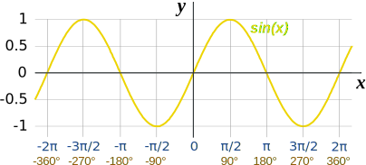

# Oscillators

## Table of Contents

  * [Overview](#overview)
    + [Visual example](#visual-example)
  * [Waveform shapes](#waveform-shapes)
  * [Offsets](#offsets)

## Overview

An oscillator is a piece of code that can give you the value of a specified waveform at a given point. You set the following data on the oscillator:

 - What type of waveform (sine, ramp-down, square)
 - What the amplitude of the waveform is (the value at the highest / lowest point of the wave)
 - How many oscillations there are per time period (we use this to set how many times the wave should repeat for the duration of a row)

Given this data, The oscillator will be able to tell you the value you want at a given point. I have created a `ProtrackerOscillator` class in my source code, which should hopefully help to show you how this works. It also has functions that can generate all three of the different wave patterns.

### Visual example

To try and visualise whats going on, think of the oscillator / waveform as a graph:



 - We set the waveform type. Here we have a sine wave, but it could easily be one of the other two (see below).
 - We set the amount of times the sine wave repeats in a given time period, which would affect how many times it would repeat on the graph between 0 and 360 degrees (which I will also refer to as between 0 and 100%). For us, this time period is a row.
 - We set the amplitude, which sets what the y axis goes up to. We set this to the maximum amount we want to change the channel volume / period by, which is given to us as an effect parameter.

## Waveform shapes

These are taken from Thunder's doc:

```
    Waveform   Name               
    ---------- -------------------
    /\  /\     Sine (default)     
      \/  \/

    |\ |\      Ramp down          
      \| \|

    ,-, ,-,    Square               
      '-' '-'  
```

## Offsets

When you don't re-trigger your oscillator (go back to point 0 at the start of every row), the waveform needs to continue smoothly when you continue into subsequent rows. 

If the waveform repeats 3.3 times per row (we say it completes 3.3 cycles), when you get to the end of the first row, the waveform will be 30% of the way through another cycle. You need to tell your oscillator this, so that when you start the next row, your waveform now starts with an offset of 30% (0.3). This would continue, so on the next row, you would need an offset of (0.3 + 0.3), and then (0.6 + 0.3), and then (0.9 + 0.3, which you'd understand to be 0.2, or 20% as going over 1 means the waveform has completed another cycle) etc.

**Example**: Looking at the sine wave graph above, at 0%, the value is 0. You can see that the wave line continues past 360 degrees a little, so let's imagine that the oscillator had been set to repeat 1.2 times per row, and that the bit that goes past 100% (360 degrees) was actually the value of our oscillator at 100% (360 degrees). So, at 100%, our oscillator reads a value of 0.5.

Now, we need to advance to the next row. If we do not change the offset of our oscillator, we will get a value of 0 if we ask for the value at 0%, just as we did before. However, we should be getting 0.5, as we need the wave to continue smoothly. This is why we set an offset - we set an offset of 0.2 (as we were 20% of the way through a cycle when we finished the last row).