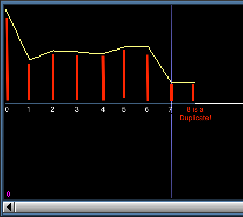

# Protracker sample playback

To play back a sample, first you need to read the sample data from the file. To do this, you read the data in the header of the file for all of the samples. You will now have information on the length of each sample. 

The data for all of the samples is stored in the last chunk of the file, with each sample's data stored sequentially. So, to read them, you must read them in order using the sample length info gained from the header info (the header info does **not** store the starting offset for each samples data, meaning you can't just get one sample header and know where to jump in to read the audio data).

Samples are stored as signed 8-bit signed values (-128 to 127).

### The first two bytes

In many Protracker docs, they tell you to ignore the first two bytes of the sample as its apparently used for loop information. **DO NOT** do this! All sample data is meant to be played. If you skip the first two bytes, it will be very noticeable on songs with short samples, like chiptunes (samples will sound wrong, and much higher pitched).

I suspect that skipping the first two bytes might be true for the old NoiseTracker modules (this info had to come from somewhere, right?). I will update this doc if I ever get to the bottom of this. 

## loops

The header info will give you a `loopStart Offset` and a `loopLength`. Now, the `loopStartOffset` is as it sounds, it tells you at which point in the data the loop starts. What the `loopLength` tells you is how many bytes **after** the `loopStartOffset` the loop goes on for. Remember that these values in the header signify words, so you must double them to make them represent bytes.

When you play a sample, if it has a loop set, you never play past the end of the loop (even if there is more sample data). If the sample does not have a loop, you play to the end and then stop.

### The extra sample

There is a strange quirk with Protracker samples. You will find that you could have a sample of length 8, a `loopStartOffset` of 4, and a `loopLength` of 4. The thing is, your data only goes from 0-7, but you need 4 samples **after** index 4 (5-8)! How does that work?

When you read your sample data into memory, you need to duplicate the last sample. This will allow you to cater for the above scenario. The best way I can describe this is that a byte, or sample, is just a number - a point on the graph. To generate any kind of wave, you need at least 2 points. So, Instead of thinking of `sampleLength` and `loopLength` as bytes, think of them as *wave sections* (the lines that connect two points, or samples).

This image shows what happens if you create a sample of length 8 in MilkyTracker using the draw feature:

Notice how the end of the sample is a flat line - this is due to the final sample, index 8, is a duplicate of index 7. As I specified the sample was 8 bytes long, I can only draw / set values for indexes 0-7.